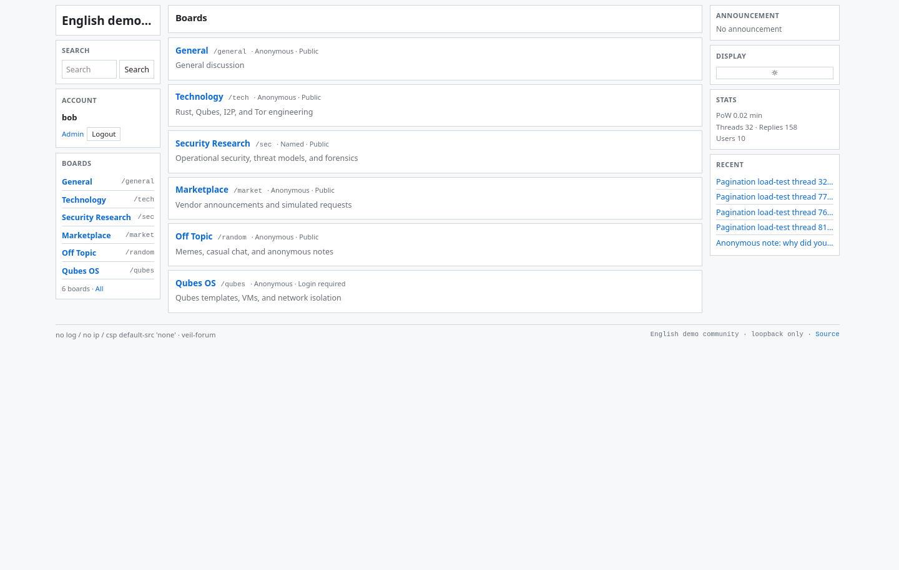
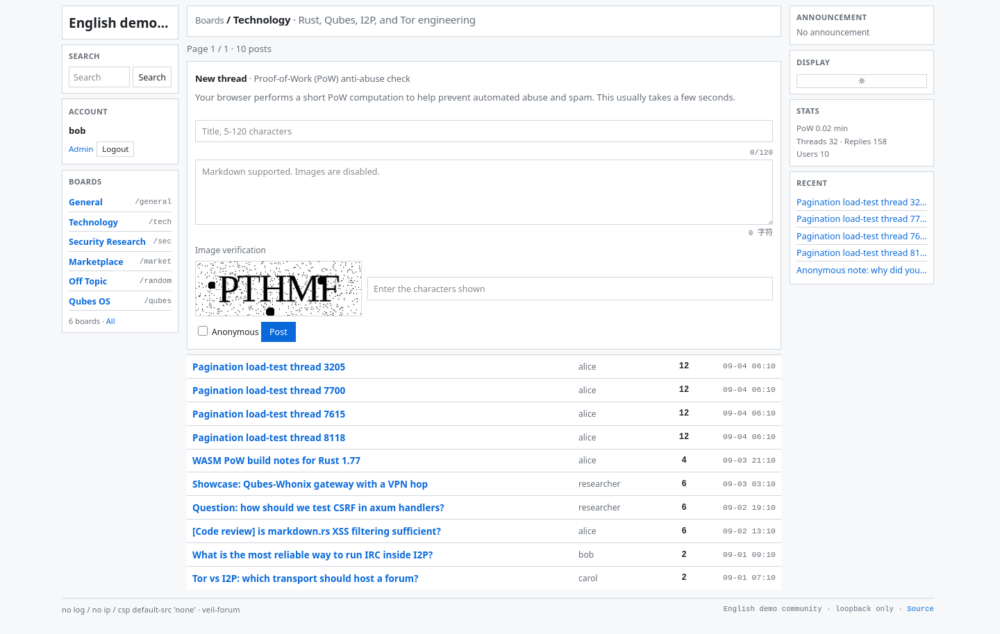
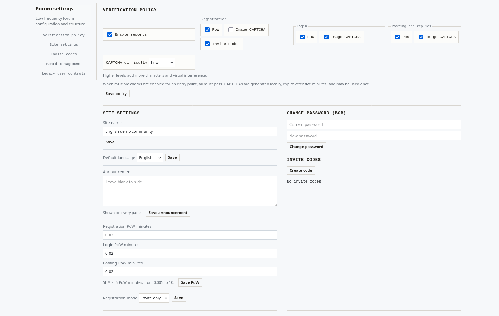
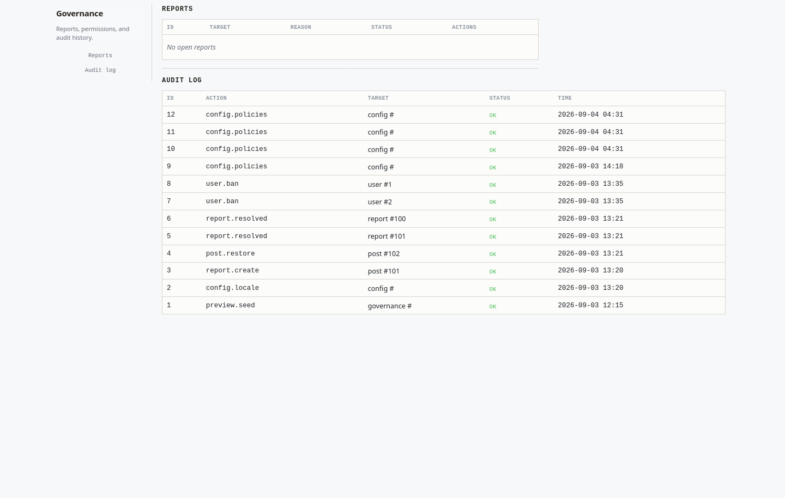

# veil-forum

An experimental, self-hosted forum for Tor Onion Service and I2P deployments.
Written in Rust with Axum and PostgreSQL, it serves HTML without requiring
JavaScript and listens on loopback by default.

**Alpha software. [AGPL-3.0-only](LICENSE).** It is intended for review and
experimental deployment, not as a guarantee of anonymity or production security.

## What it includes

- **Forum:** boards, threads, nested replies, full-text search, and optional
  anonymous posts per board.
- **Safe content:** sanitized Markdown, no remote images, and restrictive CSP.
- **Accounts:** open, invite-only, or closed registration, Argon2id passwords,
  expiring sessions, CSRF and Origin checks.
- **Two-step verification:** optional TOTP (RFC 6238) per account, with inline
  SVG enrolment QR codes, one-time recovery codes, single-use codes, and
  administrator policy switches for staff-only or site-wide enforcement.
- **Abuse controls:** independently configurable PoW and self-hosted image
  CAPTCHA for registration, login, and posting.
- **Administration:** board and invite management, configurable site/footer
  text, announcements, locale, registration policy, and audit logs.
- **Governance:** reports, moderation actions, soft-delete recovery, scoped
  roles, and session revocation.
- **Deployment:** embedded PostgreSQL migrations, `pg_dump` backups, a local
  Unix-socket connection with peer authentication, and loopback-only-by-default
  operation for a local Tor or I2P gateway.

## Screenshots

The following screenshots show the English demo instance and its server-rendered administration workspaces.









## Quick Start

### From a release archive

Download the archive for your CPU architecture and its checksum from the
[releases page](https://github.com/Marry102123/veil-forum/releases), then:

```bash
sha256sum -c veil-forum-*-checksums.txt
tar -xzf veil-forum-*-x86_64-unknown-linux-musl.tar.gz
cd veil-forum-*
```

The release provides Linux archives for x86_64, aarch64, armv7, riscv64, i686,
powerpc64le, and s390x targets. Choose the exact target matching your CPU and
libc. The archive includes the `static/` directory. Keep it next to the binary,
or install it at `/usr/local/static` when using the service templates.

### From source

Requirements: Rust 1.88 or newer and PostgreSQL 15 or newer (with the
`pg_trgm` extension from the contrib modules). The repository pins the CI and
local development toolchain through `rust-toolchain.toml`.

Create the role and database once. The role name matches the operating system
user so peer authentication works over the local socket, and no password is
stored anywhere:

```bash
sudo -u postgres createuser --no-createdb --no-superuser "$USER"
sudo -u postgres createdb -O "$USER" veil_forum
```

```bash
cargo build --release
```

### First run

Set a unique 12-128 character administrator password only for the first start:

```bash
VEIL_ADMIN_PASSWORD='replace-with-a-long-random-password' \
  ./target/release/veil-forum \
  --addr 127.0.0.1:8001 \
  --database-url 'postgres://veil-forum@%2Fvar%2Frun%2Fpostgresql/veil_forum'
```

`--database-url` defaults to that local socket URL and can also be supplied
through `DATABASE_URL`. The password in a connection string is never printed;
startup errors show it replaced with `***`.

For a release archive, run `./veil-forum` instead. Open
`http://127.0.0.1:8001` locally. Remove `VEIL_ADMIN_PASSWORD` from the service
environment after initialization.

The server refuses non-loopback listeners unless `VEIL_ALLOW_NONLOOPBACK=1` is
explicitly set. Keep the default listener and expose it only through a local
Tor or I2P gateway.

## Architecture

```text
Tor Onion Service ─┐
                   ├── 127.0.0.1:8001 ── veil-forum ── PostgreSQL (Unix socket)
I2P HTTP Server ───┘
```

## Security and Privacy

The application does not require email addresses, client IP addresses, third
party authentication, analytics, CDNs, remote fonts, or external images. It
uses restrictive response headers, sanitized Markdown, CSRF protection, and
absolute plus idle session expiry.

Deployment remains the operator's responsibility. Protect the database and its
server, gateway private keys, backups, operating system, and
service egress. Anonymous display names are not a guarantee of anonymity.

## Documentation

- [Onion and I2P deployment](docs/onion-i2p-deployment.md)
- [Operations: backup, recovery, upgrade, and systemd](docs/operations.md)
- [Anonymous deployment security checklist](docs/security-checklist.md)
- [Security reporting policy](SECURITY.md)
- [Changelog and known dependency limitations](CHANGELOG.md)

## Development

```bash
cargo fmt --all -- --check
cargo test --all-targets
cargo clippy --all-targets
cargo build --release
cargo audit --ignore RUSTSEC-2023-0071
```

The optional `external-go-interop` feature requires a separate Go compatibility
project. Set `VEIL_GO_PROJECT` and optionally `VEIL_GO_BIN` before enabling it.

## License

Copyright (C) 2026 veil-forum contributors.

veil-forum is licensed under the GNU Affero General Public License, version 3
only. Network deployments of modified versions must provide corresponding
source to remote users as required by AGPL section 13.
